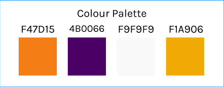

<h1 align="center">BrainTrainer - The Memory Game</h1>

[View the live project here.](https://sdthomas91.github.io/brain-trainer/)

This is a brain training memory game that allows users to progress through increasingly difficult flip card memory challenges. It is designed to be responsive across all devices and will contain a high score and timer section to enable users to continuall improve.

Utilising Bootstrap row/column tool the site will present responsively and in a well structured, readable, easy to navigate way so as to allow maximum UX. With the use of Javascript the web app will provide a visually appealing and mentally challenging, yet fun and interactive game.

With the use of Jest I will continuously test my code with the red green refactor method to ensure that each function is built in the most efficient way and to avoid future bugs,

<h2 align="center"></h2>

## Future Developments

1. Leaderboard - at present the Leaderboard is a fairly static document. It works in as much as it will log the players best time to the leaderboard. Within the current version a best time will always be logged at rank 1 with some deliberately low scores logged automatically to the remaining positions. In future developments a backend will be developed in order to allow proper interactive ranking and allow the player to overwrite the other positions should their score allow.
2. Backend - In future developments there will be a backend. At present local storage is used to log a best time but this poses some issues when it comes to a new/different player or changing devices. Future development will see the ability to log in, store best times and have the leaderboard rank different players times from different accounts, giving it a more competitive edge.
3. Additional Levels - For this stage of the project I included just 1 level to showcase the functionality of the game, including sound effetcs, animations and javascript elements such as the timer and onclick functions. In future developments the game will allow players to progress onto the next level, once they have completed the level(s) prior. They will also be able to revisit levels to work on their best times.
4. Added achievements - ideally, in a later version of the game, there will be 3 stored tiers of completion times for each level. For each tier the player reaches, a star will be achieved. This will encourage players to practice and improve.
5. Attempts counter - I wanted to use the attempts counter functionality, however the original intent was for it to count the card flip attempts. With the game board being as small as it is I decided to use it upon game completion for now. Future developments will see a "card flips" counter instead as well as a "failed" counter for whenever the user resets the game with the reset button.

## Known Bugs

1. Music Toggle - The function itself works fine, however it causes issues in the console when added to the script.js file. I had assumed that the issue lay with the fact that the script was running before DOM had loaded. I tried using the DOMContentLoaded eventListener but this did not help. For now, the script runs fine as long as it is inserted straight into the html files. Not ideal, and a fix will be included in future developments. ----- UPDATE ----- decided to include music on all pages so as to avoid script loading issues and also to keep a consistent feel throughout the site. Music toggle funcion now flawless across pages and devices.
2. Music Playing - there is a slight issue with the autoplay function in that it doesn't always play on page refresh. Fresh page load, or page load from clicking the link is usually successful. Look over a number of articles and tutorials but it would seem the setup is correct. Will need to be rectified in a later version. For now the toggle works and the music plays more often than it does not. Does not interfere with gameplay so not a major bug.

## User Experience (UX)

- ### User stories

- #### First Time Visitor Goals

    1. As a First Time Visitor, I want to easily understand the main purpose of the game and understand how to play.
    2. As a First Time Visitor, I want to be able to easily navigate the game and start a game with ease.
    3. As a First Time Visitor, I want to be able to easily understand what will happen when I interact with areas of the site

- #### Returning Visitor Goals

    1. As a Returning Visitor, I want to see if there are new levels available.
    2. As a Returning Visitor, I want to check my previous scores.

- #### Frequent User Goals

    1. As a Frequent User, I want to be able to continuously improve upon my previous score.
    2. As a Frequent User, I want to be able to progress.

- ### Design

- #### Colour Scheme

  - The three main colours used are #f47d15 (Interaction Feedback), #4b0066 (Main Colour), #f1a906 (Secondary colour - headings etc.) and off-white #f9f9f9 (Light).
  - All colours tested on WebAIM Contrast Checker - some changes were made, including making #4b0066 the main colour due to it's good contrast with all other colours.

    

- #### Typography

  - The Kavoon font is the main font used throughout the whole website with Sans Serif as the fallback font in case for any reason the font isn't being imported into the site correctly. Kavoon provides a fun, game style font whilst maintaining a good level of readability for accessibility purposes.
  - Additional typography where needed (game instructions etc.) will be a simple Sans Serif font such as Verdana.

- #### Imagery

  - All images used will be credited - main logo and card front created by myself.

- #### Interaction Feedback

  - Accent colours are used upon interaction such as hover and click to provide feedback to the user that they are interacting with an element, and that the element serves a purpose.
  - Sound effects are used to enhance the game experience on flipping, correct match, incorrect match and game completion.
  - Animation used for the card flip to give it a realistic feel rather than just flicking from one image to the next. Makes the game feel better quality and more enjoyable/pleasant to play.

## Wireframes

- All basic wireframes can be found here - [View](https://www.figma.com/file/zAQX9o6OAKkXcJyxj9RKId/BrainTrainer-Wireframe?type=design&node-id=0-1&mode=design)

### Deviations

  It should be noted that whilst the wireframes were implemented as part of the skeleton phase of UX planning at the outset, applying that 5 S's throughout led to some important amendments to increase functionality. I also realised that having originally planned for multiple levels, this was going to impact timeframes and mean the quality of the work may suffer. Further levels could be added as a later version, but for the scope and timeframe of this project I decided to stick with one level, with the interaction feedback explaining as much (prompts when clicking on locked levels etc.)

## Features

- Responsive on all device sizes

- Advanced Javascript providing a smooth interactive gaming experience

- Ability to progress and improve by competing against your own time

- ID's used in order to access DOM and manipulate date

- Modals used to instructions to avoid unncessary navigation away from the main page

- Tiles used to illustrate a clear journey through levels etc.

- Interaction feedback used throughout - this includes all clickable buttons/links, cards, sound effects, animations.

- Leaderboard allows players to rank themselves (functionality to be improved in later versions)

### User Feedback Implementations

- A number of users fedback that they would rather the music play across all pages and maintain the functionality to toggle music on and off. Gentle piano music used as it can aid memory function and concentration.
- Issues with logo sizing impacting game view on smaller devices - used image and text combination with bootstrap responsive options to display each respectively. This allows for a more seamless cross platform experience.
- Clearer notice that level is locked upon click and also when game was completed - originally had an alert but decided to use a modal and implement some logic to show the modal automatically once each relevant trigger was found.

## Technologies Used

### Languages Used

- [HTML5](https://en.wikipedia.org/wiki/HTML5)
- [CSS3](https://en.wikipedia.org/wiki/Cascading_Style_Sheets)
- [Javascript](https://en.wikipedia.org/wiki/JavaScript)

### Frameworks, Libraries & Programs Used

1. [Bootstrap 4.4.1:](https://getbootstrap.com/docs/4.4/getting-started/introduction/)
   - Bootstrap was used to assist with the responsiveness and styling of the website.
2. [Jest](https://jestjs.io/)
   - Jest was used to continuously test and grow my code and functions
3. [Hover.css:](https://ianlunn.github.io/Hover/)
   - Hover.css was used on the Social Media icons in the footer to add the float transition while being hovered over.
4. [Google Fonts:](https://fonts.google.com/)
   - Google fonts were used to import the 'Kavoon' font into the "Head" section of each html file which is used on all pages throughout the project.
5. [Font Awesome:](https://fontawesome.com/)
   - Font Awesome was used throughout the website to add icons for aesthetic and UX purposes.
6. [jQuery:](https://jquery.com/)
   - jQuery came with Bootstrap to make the navbar responsive but was also used for the smooth scroll function in JavaScript.
7. [Git](https://git-scm.com/)
   - Git was used for version control by utilizing the Gitpod terminal to commit to Git and Push to GitHub.
8. [GitHub:](https://github.com/)
   - GitHub is used to store the projects code after being pushed from Git.
9. [Illustrator:](https://www.adobe.com/uk/products/illustrator.html)

- Illustrator was used to create the logo and card fronts.

10. [Figma:](https://www.figma.com/)

- Figma was used to create the wireframes during the design process.

11. [CSSGradient](https://cssgradient.io/)

- CSSGradient.io was used to generate css gradient backgrounds.

12. [StackOverflow](https://stackoverflow.com/)

- Used for code snippets and code validation

## Testing

A separate tests document has been added to showcase the Javascript testing - this can be found in the scripts directory. I also duplicated the script document which can be found is game.js - this was to avoid having to remove event listeners and comment out exports etc. for published site to run effectively but also to make testing easier.

- Little to no HTML CSS testing was required due to the simplicity of the web pages - still validated through W3C validator as listed below.

The W3C Markup Validator and W3C CSS Validator Services were used to validate every page of the project to ensure there were no syntax errors in the project.

- [W3C Markup Validator](https://validator.w3.org/nu/#textarea) - Results can be seen in TESTING.md including errors and final validation
- [W3C CSS Validator](https://jigsaw.w3.org/css-validator/#validate_by_input) - - Results can be seen in TESTING.md including errors and final validation

### Testing User Stories from User Experience (UX) Section

- #### First Time Visitor Goals

  1. As a First Time Visitor, I want to easily understand the main purpose of the site and learn more about the practitioner/organisation.

     1. Upon entering the site, users are automatically greeted with a clean and easily readable navigation bar to go to the section of their choice. Underneath there is a Hero Image with encouraging text and a "Book Now" Call to action button.
     2. The title gives a clear idea of the service being provided and prompts to book in.
     3. The user has two options, click the call to action buttons or scroll down. The former will allow them to book/enquire about the services available, the latter will allow them to learn more about the organisation.
     4. The back to top button gives the indication that there is more site to scroll, encouraging the exploration of the site.

  2. As a First Time Visitor, I want to be able to easily locate an option to contact or book in.

     1. There are two immediate options when first loading the page to book in for the services mentioned, wherein you can select the services you are interested in. This enables a modal so there is no need to leave the page in order to complete the booking process,.
     1. The site has been designed to be fluid and never to entrap the user. The site provides a fixed nav bar and plenty of navigational links throughout the flow of the continous scroll page.
     1. On the Contact Us Page, after a form response is submitted, the page refreshes and the user is brought to the top of the page where the navigation bar is.

  3. As a First Time Visitor, I want to be able to easily navigate throughout the site to understand pricing and details of different services

     1. The user has immediate navigational ability to reach the pricing and services section via the nav bar
     2. With the flow of the site, once the user has read the services section they are able to navigate by either scrolling to the next section for pricing or clicking on the "See Pricing" links to go directly to the relevant pricing.

  4. As a First Time Visitor, I want to look for testimonials to understand what their users think of them and see if they are trusted. I also want to locate their social media links to see their following on social media to determine how trusted and known they are.
     1. Once the new visitor has read the About Us and What We Do text, they will notice the Why We are Loved So Much section.
     2. The user can also scroll to the bottom of any page on the site to locate social media links in the footer.
     3. At the bottom of the Contact Us page, the user is told underneath the form, that alternatively they can contact the organisation on social media which highlights the links to them.

- #### Returning Visitor Goals

  1. As a Returning Visitor, I want to find new or existing services.

     1. All services are listed in the Book Now Modal so returning users can enquire directly about any new or existing services
     2. The sites navigation allows smooth access to services section with full details of the service and a link to the pricing for that service

  2. As a Returning Visitor, I want to find the best way to get in contact with the organisation with any questions I may have.

     1. The navigation bar clearly highlights the "Contact" Section with additional ability to directly WhatsApp.
     2. Here they can fill out the form on the page, there are also options including email, WhatsApp and Facebook.
     3. The footer contains links to the organisations Facebook, Twitter and Instagram page as well as another link to the contact section.
     4. Whichever link they click, it will be open up in a new tab to ensure the user can easily get back to the website.
     5. The email button is set up to automatically open up your email app and autofill there email address in the "To" section.
     6. The WhatsApp link will work to open a conversation directly in WhatsApp with the relevant number.

  3. As a Returning Visitor, I want to find Community/Social links.
     1. The Facebook Page can be found in the Contact Section and will open in a separate tab so as to allow easy navigation back to the main site.
     2. Alternatively, the user can scroll to the bottom of the page where the footer is home to all relevant social links.

- #### Frequent User Goals

  1. As a Frequent User, I want to be able to easily book my favourite services.

     1. The user would already be familiar with the Booking process but will always have easy access to the Book Now options in the callout or in the navbar that allows them to quickly submit a booking request for their chosen service.

  2. As a Frequent User, I want to check to see if there are any new results images to see work/improvements.

     1. The user would already be comfortable with the website layout and can easily click the gallery link to view up to date before and after images

  3. As a Frequent User, I want to have easy contact options to discuss my bookings.
     1. The user would be familiar with the site layout and can use the nav menu to easily locate the contact option
     2. Alternatively, in the navbar also, the user may open a WhatsApp conversation directly
     3. The user may wish to use the dedicated contact form or indeed any of the other contact options provided there including email, WhatsApp or Facebook (Messenger)

### Further Testing

- The Website was tested on Google Chrome, Microsoft Edge and Safari browsers. It was also tested in Internet Explorer Mode on Microsoft Edge.
- The website was viewed on a variety of devices such as HP Windows Desktop, Macbook, iMac, iPhone12, iPhone 14 Pro, iPhone 8, iPad Air, iPad Pro 12.9", Pixel 5, Samsung Galaxy S20 Ultra, Surface Pro 7 and Nest Hub.
- A large amount of testing was done to ensure that all sections on the continuous scroll were linking correctly.
- Friends and family members were asked to review the site and documentation to point out any bugs and/or user experience issues.

#### Google Lighthouse

- Google Lighthouse was used to ensure compatability, best practice and accessibility as well as load times.

| Lighthouse mobile                                                     |                           Lighthouse Desktop                            |
| --------------------------------------------------------------------- | :---------------------------------------------------------------------: |
|  |  |

##### Load Speed

-

##### Accessibility

- Accessibility sits at 99 out of 100 - all vitals pass the only issue they have is that an H4 is used out of order. This is not something I feel affects the site in such a way that it needs amending.
- Aria used correctly and passes on all checks

##### Best Practices

- Best Practices sits at 92 out of 100 - this was vital as it threw up an issue I had overlooked - it failed to load the previously addd PNG files. This was because the images had not been amended on the Carousel and so still affected speed and best practices.
- Amended issue identified - logged details in TESTING.md and all working well.

### Known Bugs

- No known bugs remain - game.test.js can be used to explore the different tests that were run following a red, green, refactor system.

## Deployment

### GitHub Pages

The project was deployed to GitHub Pages using the following steps...

1. Log in to GitHub and locate the [GitHub Repository](https://github.com/sdthomas91/ng-spmu-milestone)
2. At the top of the Repository (not top of page), locate the "Settings" Button on the menu.
   - Alternatively Click [Here](https://raw.githubusercontent.com/) for a GIF demonstrating the process starting from Step 2.
3. Scroll down the Settings page until you locate the "GitHub Pages" Section.
4. Under "Source", click the dropdown called "None" and select "Master Branch".
5. The page will automatically refresh.
6. Scroll back down through the page to locate the now published site [link](https://github.com/sdthomas91/ng-spmu-milestone) in the "GitHub Pages" section.

### Forking the GitHub Repository

By forking the GitHub Repository we make a copy of the original repository on our GitHub account to view and/or make changes without affecting the original repository by using the following steps...

1. Log in to GitHub and locate the [GitHub Repository](https://github.com/sdthomas91/ng-spmu-milestone)
2. At the top of the Repository (not top of page) just above the "Settings" Button on the menu, locate the "Fork" Button.
3. You should now have a copy of the original repository in your GitHub account.

### Making a Local Clone

1. Log in to GitHub and locate the [GitHub Repository](https://github.com/sdthomas91/ng-spmu-milestone)
2. Under the repository name, click "Clone or download".
3. To clone the repository using HTTPS, under "Clone with HTTPS", copy the link.
4. Open Git Bash
5. Change the current working directory to the location where you want the cloned directory to be made.
6. Type `git clone`, and then paste the URL you copied in Step 3.

```
git clone https://github.com/sdthomas91/ng-spmu-milestone
```

7. Press Enter. Your local clone will be created.

```
$ git clone https://github.com/sdthomas91/ng-spmu-milestone
> Cloning into `CI-Clone`...
> remote: Counting objects: 10, done.
> remote: Compressing objects: 100% (8/8), done.
> remove: Total 10 (delta 1), reused 10 (delta 1)
> Unpacking objects: 100% (10/10), done.
```

Click [Here](https://help.github.com/en/github/creating-cloning-and-archiving-repositories/cloning-a-repository#cloning-a-repository-to-github-desktop) to retrieve pictures for some of the buttons and more detailed explanations of the above process.

## Credits

### Code

- [Bootstrap4](https://getbootstrap.com/docs/4.4/getting-started/introduction/): Bootstrap Library used throughout the project mainly to make site responsive using the Bootstrap Grid System.

- [W3CSchools](https://www.w3schools.com/) W3C schools used for CSS/HTML confirmation

- [MDN Web Docs](https://developer.mozilla.org/) : For Pattern Validation code. Code was modified to better fit my needs and to match an Irish phone number layout to ensure correct validation. Tutorial Found [Here](https://developer.mozilla.org/en-US/docs/Web/HTML/Element/input/tel#Pattern_validation)

- [StackOverflow](https://stackoverflow.com/) : For coding validation and tips on refining code. Also used for code snippets customised with my own css or JS.

- [CodePen](https://codepen.io/samueldthomas91/pen/oNJVxYx) : Codepen was used to explore examples of the game style I wanted to implement. I also used codepen to build my JS logic as it was easier to view and edit. My final codepen before transferring it back to codeanywhere can be found [HERE](https://codepen.io/samueldthomas91/pen/OJrKNgP)

### Content

- Colour and content completely designed by myself

- Psychological properties of colours text in the README.md was found [here](http://www.colour-affects.co.uk/psychological-properties-of-colours)

- Colour combinations, hex code -> rgb conversion and palettes were found [here] (<https://www.colorhexa.com/>)

### Media

- All media was created by myself including card images

### Audio

- Error Sound : Sound effect from [PixaBay](https://pixabay.com/sound-effects/?utm_source=link-attribution&utm_medium=referral&utm_campaign=music&utm_content=7184)
- Correct Sound : Sound effect from [PixaBay](https://pixabay.com/?utm_source=link-attribution&utm_medium=referral&utm_campaign=music&utm_content=6033)
- Winning Sound :  [UppBeat](https://uppbeat.io/browse/sfx/celebrate)
- Background Music : 

#### README Mockup

- .ai file used for Mockup at the top of README file : Image by [Freepik](https://www.freepik.com/free-vector/flat-design-responsive-website-design_28747716.htm#query=multi%20device%20mockup&position=2&from_view=keyword&track=ais)

### Acknowledgements

- Tutor support at Code Institute for their support.

- Pasquale Fasulo for continuous helpful input and feedback

- My mentor, Gurjot for continued input and direction

- © 2014 Nate Wiley CodePen for the initial inspiration

- Friends and family for valuable insights and feedback
